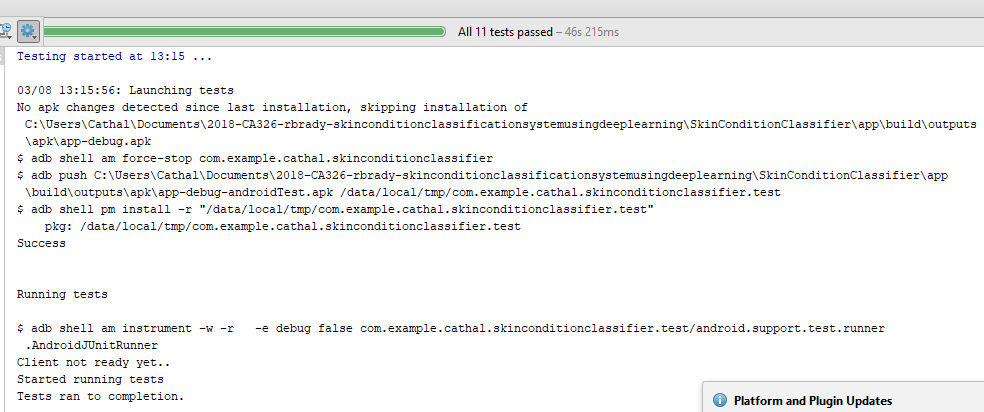

**Skin Condition Classification System Using Deep Learning**  
===================================================

3rd Year Project Testing Manual  
Cathal Hughes: 15417922  
Russell Brady: 15534623  
Supervisor: Alan Smeaton  

**Table of Contents**  
====================

+ [1 -        Testing The Android Application](#androidapp)
 	- [1.1 -        Real World Testing](#real)
 	- [1.2 -        Automated Instrument / User Interface Testing](#ui)
 	- [1.3 -        Compatibility / Portability testing](#compatibility)
+ [2 -        Testing The Web Application](#androidapp)
 	- [2.1 -        Real World Testing](#real1)
 	- [2.2 -        UI Testing](#ui1)
 	- [2.3 -        Stress Testing](#stress)
 	- [2.4 -        Network Testing](#network)
 	- [2.5 -        Unit Testing](#unit)
 	- [2.6 -        Accessibility Testing](#accessibility)
+ [3 -        Testing the Convolutional Neural Network](#cnn)
	- [3.1 -       K-Fold Cross Validation](#kfold)
	- [3.2 -       K-Fold Cross Validation - The Process](#process)
+ [4 -        Usability Testing Of Entire Project](#usability)
	- [4.1 -       Participants](#participants)
	- [4.2 -       Quantitive and Qualitive Data](#data)
	- [4.3 -       Test Cases](#cases)
	- [4.4 -       End-Of-Testing Questionnaire](#questionnaire)
	- [4.5 -       Results of Usability Testing](#results)

**1 - Testing The Android Application**
=====================================================

##**1.1 - Real World Testing**

After some testing of this specific functionality it was noticed that the application required permissions to be turned on in the settings of the real device for &quot;Internet access&quot;, &quot;Camera access&quot; and &quot;Gallery access&quot;. After this, the app could make POST requests/receive GET requests and also could use the camera and upload images from the image gallery.

Some other problems occurred in the testing of the application for the first time.

When trying to upload a photo when no photo has been selected from the gallery, the app crashed as it had nothing to upload. We fixed this byy checking if an image had been selected before trying to upload and in the case there is no imge selected a toast is shown telling the user to select an image first.

As well as this, there was a problem where a user could try see the visualisation of the resuktts before the results had been returned. This opened up the broswer to the correct URL but no results had been generated yet so itjust returned a blank webpage. This was fixed in a similar way to the problem above. The user must wait until the results are returned and if the user tries before they are returned a toast is shown saying the upload has not finished.

Also, an issue arose when taking a picture and sending it to the server. The uplload and respoonse time took far too long. This was due to the dimensions of the image, they were far to big.This was fixed by resizing th eimage before it was sent to the server and it imporved the speed massively.

##**1.2 - Automated Instrument / User Interface Testing**

To test our Android App we decided to use the Testing Framework Espresso. We used this framework to write consise Android UI tests in order to check that the app was working as expected. In creating our test cases we used two java classes from Git which helped us to set up a Test activity and also to allow us to test toasts, namely ActivityRule.java and ToastMatcher.java. We tested the following pages:

+ Splash Screen
+ Menu Page
+ Image Upload Page
+ Take Photo Page
+ Data Visualisation Page

We tested each page by testing each activity individually and checking that the correct page renders on the correct actvity. As well as this we also check that from each activity page, each page links correctly to the next appropriate activity. Some of the individual tests include taking an image and classifying it, as well as checking the splash screen page and if it correctly loads into the main menu page. 

##**1.3 - Compatibility/Portability testing**

In order to test the forward compatibility of the application, devices of each android build from marshmallow 5.0 up to current were tested via the android studio emulator. This allowed us to see any possible compatibility problems from the start. 
This led to problems however; We found that the CameraKit Library that we were using would cause the app to crash on Android 5.0 and that it actually ran very slowly on Android 6.0 and 7.0. This baffled us as it was the most up to date version of the library. We downgraded the library and it then began to run on 5.0, whilst also running much faster on 6.0 and 7.0.

**2 - Testing The Web Application**
==============================================

To test the web app we used a few methods, exploratory testing, UI testing, stress testing, Unit Tesing, network testing along with user testing. All these respective methods found bugs that needed to be fixed.

##**2.1 - Real World Testing**

When we first deployed the web app we deicded to both use it to find as many errors as possible. We will discuss these below.

**Error 1:**  Of course, this identified certain problems, in particular with the "Classify Skin Condition" Button. This button could be clicked even if no image had been uploaded and undoubtedly caused the web app to crash as it had no file to pass to the convolutional neural networks. We fixed this by flashing a message upp on screen if no image had been sleected in the HTML form. This fixed the issue and prevents the web app crashing.

Fixing this error was paramount as the it lead to a 500 code error and rendered the web app useless.

**Error 2:** Also, we found that any sort of file could be uploaded to the server e.g. a .doc file or .ppt. This was an issue as when files like this were uploaded, they could not be processed as images and it caused the server to throw a 500 error. This was fixed by creating a method which checked the extension and made sure it was allowed before allowing it to be used on the server. If it isn't a valid extension an error message is flashed on the screen.

**Error 3:** Some issues arose from the use of routes. "/predictClient" is where the HTML form posts its image data and if we made a get request to this route, it also caused an internal server error. This was fxed by redirectig to the web app home page if a GET request was made to that particular route. Similar occurred with the "/email", "/predict" routes and they use the same fix.

**Error 4:** Some other issues found from explortory testing was not being able to close the flash messages that occured on the screen. A message like "Image Uploaded" had an "X" or close button which did not work. To fix this we had to use a javascript script whcih actiavted the close button.

##**2.2 - UI Testing**

We used splinter tests to test our UI. These run using a WebDriver and can click through the web app automatically. These are tests that are run headless and so we will run these every night along with the unit tests. They can be run using a browser or can be run headless, meaning they dont need a browser.

Some tests written include, uploading an image, uploading a file which is not an image, uploading an image and then sending an email of the results, try click classify button without uploading.

These tests did not find any new errors but gave us confidence that our web app worked well and all bugs had been fixed with regard to the UI and routes. 

##**2.3 - Stress Testing**

We performed stress testing on the backend code by hosting it on an AWS EC2 Instance. We then bombarded the server with requests from both the web app and the android application. All of a sudden the server code began to hang and no new post requests were being handled.

To fix this we had to set a boolean "threaded=True", this makes the app run mulithreaded and solved that issue of it hanging. We left the server running overnight and by the next morning we were not able to access it. This was down to an error using putty. To fix this we ran the python script for the server using tmux.

##**2.4 - Network Test**

The web app and android app was tested using both mobile data and wifi. Neither made any difference and results were returned as efficeintly as the other. Hosting the web app on a remote server really improved interaction times. We are ussing a deep learning server provided by Amazon Web Services. When running the server locally on our own machines, the computing power required was not enough and  it took far too long to return results.

##**2.5 - Unit Testing**

Unit testing was used to test all the routes ofthe web app and all the functions that these routes use. We have 96% testing coverage on our backend code. That means 96% of the statements are tested by our unit tests.

Very early on in the project when testing the get predictions method we found that evrey time that method was called, each model would have to be loaded before it could make a prediction. This slowed down the web app and android app massively. After research we found we could load the models once when the server is turned on and they remain loaded whilst the server is on. The speed increase we got from this really improved the project as a whole and show the importance of unit tests. 

For the unit tests we imported python's own unittest module and also used Flask's built in unit tests for testing the routes.

All methods used in our backend are tested, this includes methods for getting the predictions, generating the bar chart results, processing an image. 

Unit testing the "/predict" route was the most difficult as this route is specific to the android app. So to test this route we had to mimmick the interaction of the android app which involved encoding an object and adding it to JSON object.

The unit tests will be run at 12am along with UI tests. This will be configured to run using CRONTAB which is a process scheduler. We also have a script which runs all the tests concurrently locally.

##**2.6 - Accessibility Testing**

As part of the User Experience and usability testing we conducted some accessibility testing. This involved:

**Unplugging the mouse/Turning off the trackpad:**
We did this in an effort to see that every element of the web app was accessible by just using the keyboard. We aimed to see if all inputs could be entered and interact with without having a mouse. This returned a bug as we could not use the enter button to submit a username and password in the log item page. Complications arose as the form was of type “button” and not “submit”. Yet it needed to be of type “button”. After some research online we found some javascript that clicked the button automatically once the enter button had been hit. If we had not resolved this issue someone who did not use a mouse would have been stuck on the log item page which mean we would have had developed a very inaccessible UI. 
**Turn on High contrast mode:**
Colour contrast is huge in developing a UI for a website or web app.  It is essential that the colours we used for the design of the UI worked well as people with colour blindness could have been using it. Turning up the colour contrast allowed us to see if the colours still worked in the event someone had to turn up the colour contrast.  Initially when we did this we felt the colours didn’t work that well and so we used an online tool to help us sort out the colour contrast issue.
**Turn off CSS:**
We built the whole web app in HTML before applying any CSS at all, this ensured that the web app would work in the event someone was required to turn off the CSS. Colour and style should not be the only means of communication. We did this to make sure no text or content was lost in the event someone turned off the CSS.

**3 - Testing The Convolutional Neural Network**
==============================================================

Testing the Convolutional Neural Networks was the toughest part of testing. For starters neither of us had used or heard of CNNs before Third Year. They are very computationally exoensive to run and as a result we knew that any sort of  testing was going to need a  lotof time and computing power. After consultation with our supervisor, Alan Smeaton, he suggested that we perform a K-Fold Cross Validation.

##**3.1 - K-Fold Cross Validation**

A K-Fold Cross Validation is the most comprehensive way to test a neural network or a convolutional neural network. It is not done that often as it is reagrded as too computationally expensive. Initially, we did not know how we were going to do something which is so computationally expensive on our standard laptops. Then we tought of using Amazon Web Services againfor running the K-Fold Cross Validation scripts and run them over night and implement early stopping. We used the K-Fold Cross Validation to tweak some hyper-parameters and it specifically helped us decided on the optimum number of epochs to use when properly training the networks.

##**3.2 K-Fold Cross Validation - The process**

A 5-Fold Cross Validation requires splitting your training data into five 80:20 splits. Each time it is trained on the 80% and validates on the 20%. We implemenented early stopping to prevent overfitting and find the optimal number of epochs. Once this has run 5 times on the different 80:20 splits, you train the final network on the full 100 and a new validation set using the optimal number of epochs which you found from the k-fold cross validation process.

**4 - Usability Testing Of Entire Project**
======================================================================

In usability testing of both the web app and the android app our primary focus was on ease of use as well as ease of familiarisation with the system and satisfaction of users with the entire experience. The idea of our usability testing was to find out where the system rates highly and where it may be falling down.   

For our usability testing we decided to use the ISO 9241-11 standard which is an internationally recognised standard for HCI and Usability. The Usability metrics complying with this ISO standard are the following: 

- Effectiveness: The accuracy with which the user completes the goals
- Efficiency: Resources expended to complete goals and time taken
- Satisfaction: The ease of user in completing goals and their happiness when using the system

Along with completing a set of tasks the participants were given an accompanying survey at the end of testing to gather their final thoughts. 

##**4.1 - Participants**
Because this standard focuses on the experience of first-time users using the system we gathered a group of random people who had never used our system before to test both applications. Although the users weren't to be familiar with the app they had to be familiar with the device they were using. This meant gathering Android users to test the Android app. We were able to gather anybody to test the web app as it could be accessed via a normal web browser that people would be familiar with.  

##**4.2 - Quantitive and Qualitive Data**
The great thing about this standard is that it offers both quantitive and qualitive data. We gain qualitive data from usability metrics such as completion rates, error rates and task time. These involve actual figures which we can interpret, evaluate and then decide if we are happy with them. Qualitive data is just as important however as it gives us an insight into the users opinion when using the system. The main usability metric here is satisfaction from undertaking the tasks as well as from the end of testing questionnaire.  

##**4.3 - Test Cases**
The following are the test cases we got our participants to undertake when completing the usability testing:

**Web App**

- Access web app and upload an image for classification
- Access web app and take photo for classification
- Classify image and send their results via email

**Android App**

- Access android app and upload image for classification
- Access android app and take photo for classification
- Access visual representation of results and send 

We created the test cases in an Excel document and used this as our template for gathering our results as can be seen below. Each participant had their own set of results documented in their own Excel sheet. All these results were then compiled to come up with our final set of results and come to a conclusion regarding the findings. 

##**4.4 - End-Of-Testing Questionnaire**

We wanted a questionnaire to follow our Usability testing so we could extract as much useful information out of the user as possible. Having done research regarding suitable Ubability Testing questionnaires we decided to use The System Usability Scale (SUS). It is a 10 question questionnaire that is very useful in guaging the users satisfaction with the system. Below is the questionnaire we used:

Interpreting scoring can be complex. The participant’s scores for each question are converted to a new number, added together and then multiplied by 2.5 to convert the original scores of 0-40 to 0-100.  Though the scores are 0-100, these are not percentages and should be considered only in terms of their percentile ranking.

Based on research, a SUS score above a 68 would be considered above average and anything below 68 is below average, however the best way to interpret your results involves “normalizing” the scores to produce a percentile ranking.

##**4.5 - Results Of Usability Testing**

From our usability testing of the web app and android app we gained some quality information of how easy first time users interacted with the system. It was clear that users found it easier to use the web app than the android app (A suspicion we already had). This was backed up by the scoring in our usability survey which ranked the Web App at an average of 85/100, while the android app ranked at an average of only 70/100. Although the scoring for the android app is still above the SUS average we would still have hoped for a better score. 

In terms of the test cases that were carried out, all participants found them relatively easy and all tasks were completed. 

The main comments which we noted were that the camera on the web app than on the android app. With more time we would have rectified this issue in order to make it more user friendly. Overall however, we were very happy with the feedback we received, not only from the participants in the usability testing but everyone who we got to perform exploratory testing. 